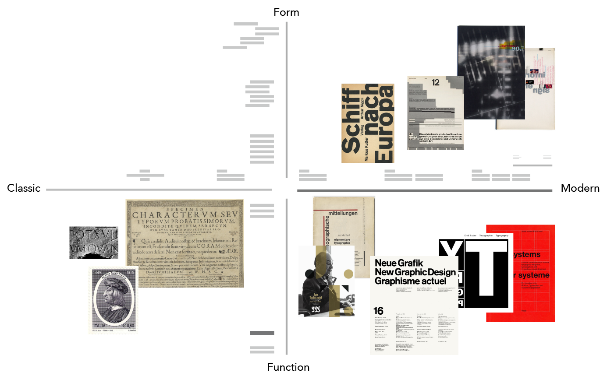
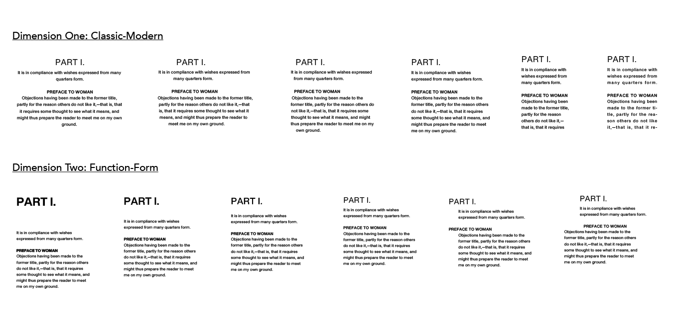
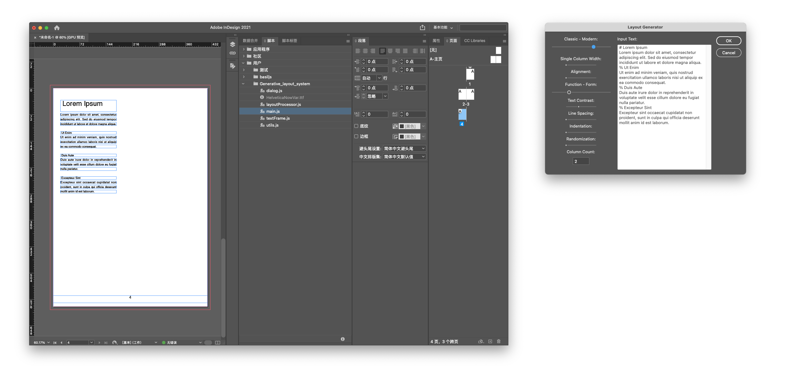

# Generative Layout System

This repository is an experimental layout system I developed after studying various typographic theories, including the Japanese designer [Yoshihisa Shirai](https://x.com/ShiraiKeisei)'s [_Idea_ magazine](https://www.idea-mag.com/en/), Swiss designer [Karl Gerstner](https://en.wikipedia.org/wiki/Karl_Gerstner)'s variable grid system, German designer [Erik Spiekermann](https://en.wikipedia.org/wiki/Erik_Spiekermann)'s [_Explorations in Typography_](https://explorationsintypography.com/), and the [TeX](https://en.wikipedia.org/wiki/TeX) typesetting system by American computer scientist [Donald Ervin Knuth](https://en.wikipedia.org/wiki/Donald_Knuth).

Although these creators are active in different fields, they all attempt to tackle a common challenge: integrating complex content and form into a cohesive system. This is also the boundary that my experimental work aims to explore further.

## Overview

This is a script system developed for InDesign to automatically generate layouts. It allows users to input their text content and select visual styles to automatically create various layouts on a two-dimensional coordinate system, ranging from classic to modern and from function to form.

The image shows the layout effects generated by the script after selecting different dimensions. Dimension one ranges from classic to modern. This dimension transitions the layout from center-aligned to left-aligned by adjusting alignment, single-column width, and the number of columns. As the columns shift to the left margin, a single column becomes two columns, and then three columns, transitioning from left-aligned to justified alignment. Dimension two ranges from function to form. This dimension adjusts variables such as variable font axes, distance between headings and body text, font size contrast, and indentation methods. This causes the layout system to transition from maximum contrast in font size and weight, with maximum distance between headings and body text, to paragraph indentation and random paragraph offset.

## Installation

1. **Prerequisites**: Ensure you have Adobe InDesign installed on your system.
2. **Download the Script**: Clone or download the repository to your local machine.
3. **Load the Script**: Add the script file to the Scripts folder in your InDesign application folder or in the Scripts Panel folder in your preferences folder. To display the Scripts panel, choose `Window > Utilities > Scripts`.

## Usage

1. **Open InDesign**: Start Adobe InDesign and open an existing document or create a new one.
2. **Run the Script**: Execute the `main.js` script from the Scripts Panel.
3. **Input Parameters**: A dialog will appear allowing you to input text and adjust layout parameters such as column count, column width, and various stylistic sliders.
4. **Generate Layout**: Click 'OK' to generate the layout based on your inputs.

## File Structure

- `main.js`: The main script file that initializes the document and processes layout parameters.
- `dialog.js`: Handles the creation and management of the user input dialog.
- `layoutProcessor.js`: Contains functions to process and apply layout parameters to the document.
- `textFrame.js`: Manages text frame creation and manipulation.
- `utils.js`: Utility functions used across the script.

## Contributing

Contributions are welcome! Please fork the repository and submit a pull request for any improvements or bug fixes.
